# bamazonCLI

Going into node bamazonCustomer.js will bring up all the items in the bamazon database

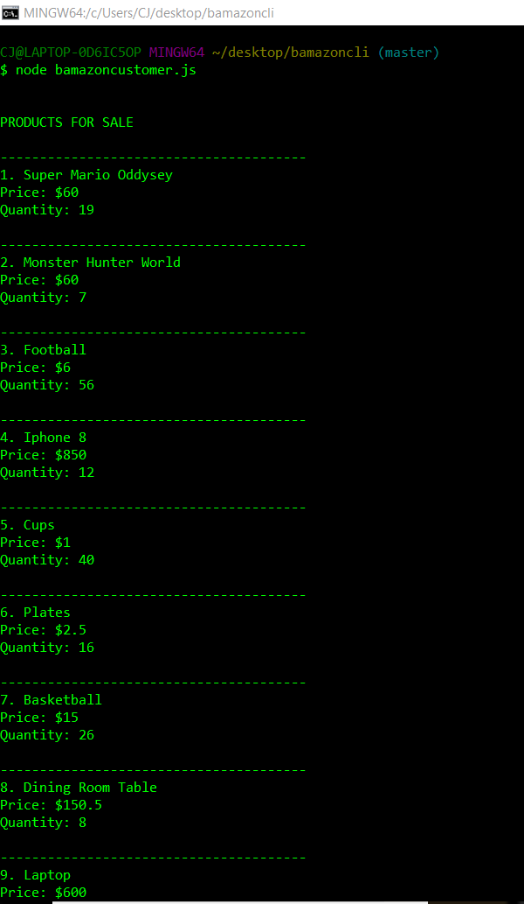

Then it will ask what product you would like to buy

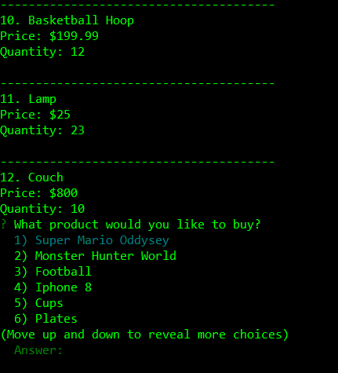

First you pick the item and then it asks how much of the item you would like to buy. When you are done filling in the questions it will show how much of the item you bought and the total price.

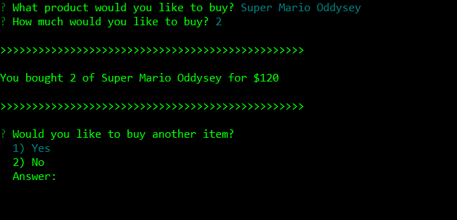

If you put an invalid amout it says insufficient quantity

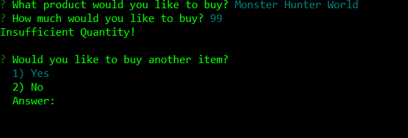

Going into node bamazonManager.js will ask what you want to do

View products for sale will view all the current products along with price and quantity

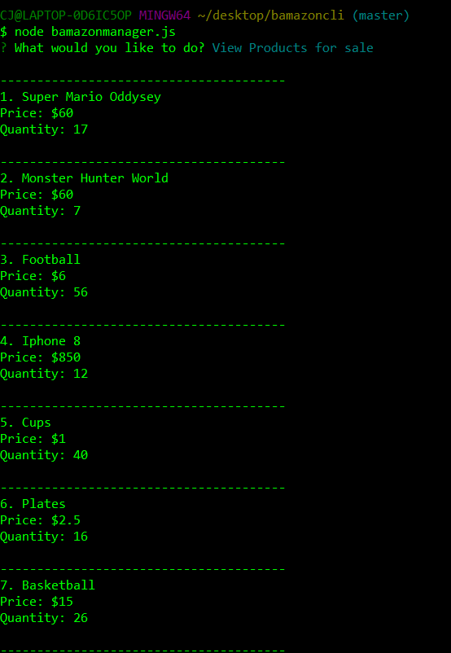

View low inventory will show all the products that are below 5 in quantity

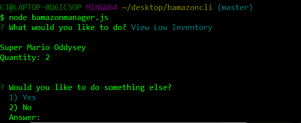

Add to inventory will ask what product you want to add to and the quantity you want to add. It will update the database afterwords.

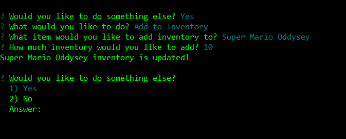

Add new product will let you add a new product to the database

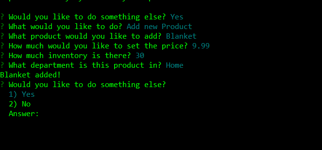

node bamazonSupervisor.js will ask 2 questions first

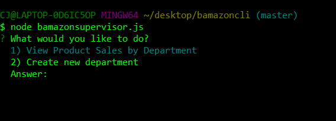

View product sales by department will show the over head cost and product sales of all the items the customers bought and it will show the current profits

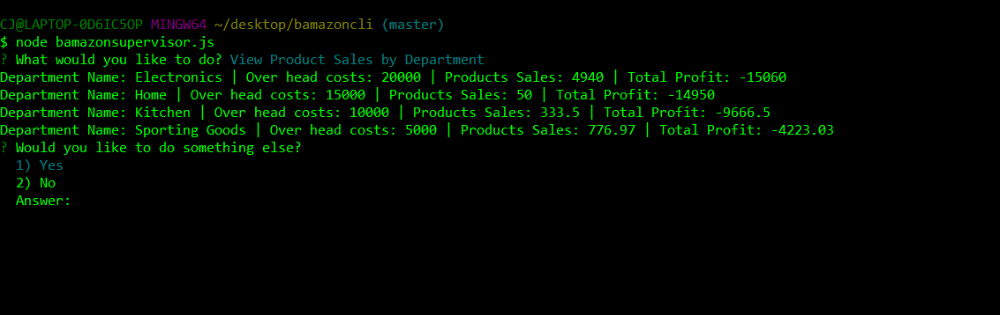

Create new department will let you create a new department so you can see the profits for the department when you go to view product sales by department

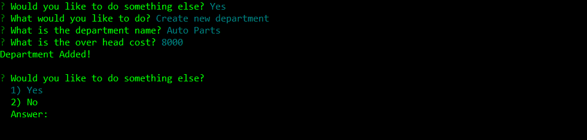
